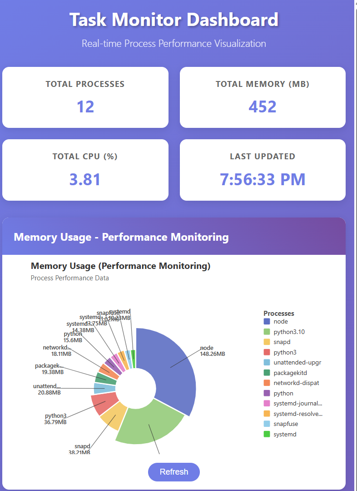
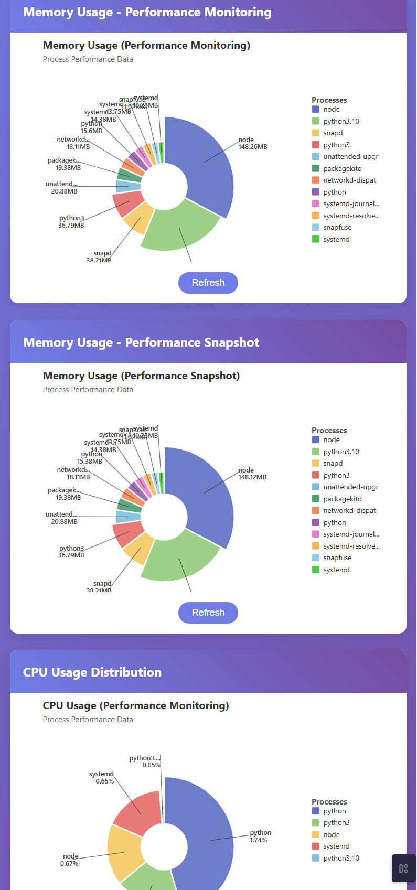

# Task Monitor Application

A Python-based system performance monitoring tool that captures running processes and saves performance data to CSV files. Features a beautiful web dashboard with D3.js nightingale charts and **real-time view switching** between snapshot and monitoring data.

## Features

- 🖥️ **Process Monitoring** - Tracks top memory-consuming processes with CPU usage
- 🌹 **Interactive Dashboard** - Beautiful D3.js nightingale (rose) charts with external labels
- 🔄 **View Switching** - Toggle between snapshot and monitoring views in real-time
- 📊 **Dual Modes** - Single snapshot or continuous monitoring with integrated dashboard
- 🌐 **Web Interface** - Flask-powered dashboard with live data visualization
- 🗂️ **CSV Export** - Saves performance data with timestamps in databag directory
- 📝 **Centralized Logging** - Structured logging with detailed process information
- ⚙️ **Configurable** - Customizable process limits and monitoring intervals
- 📱 **Responsive Design** - Works on desktop, tablet, and mobile devices
- 🔄 **Auto-refresh** - Dashboard updates every 30 seconds or manual refresh
- 🚀 **One-Command Startup** - Single script handles snapshot, monitoring, and dashboard

## Project Structure

```
task-monitor/
├── app/
│   ├── requirements.txt         # Python dependencies
│   ├── backend_server.py        # Flask web server
│   ├── src/
│   │   ├── csvconverter.py      # CSV generation and monitoring orchestration
│   │   ├── gettasks.py          # Process data collection and monitoring
│   │   └── utils/
│   │       ├── logger_utils.py     # Centralized logging system
│   │       ├── logging_config.py   # Logging configuration
│   │       └── __init__.py
│   ├── static/
│   │   ├── css/
│   │   │   └── dashboard.css    # Dashboard styling
│   │   └── js/
│   │       └── dashboard.js     # D3.js chart logic
│   └── templates/
│       ├── dashboard.html       # Main dashboard template
│       └── test-charts.html     # Chart testing page
├── databag/                     # CSV data files (auto-created)
│   ├── performance-monitoring.csv
│   └── performance-snapshot.csv
├── logs/                        # Application log files (auto-created)
├── run.py                       # Command-line monitoring tool
├── start.sh                     # Manual CLI script
└── start_dashboard.sh          # Complete dashboard startup script
```

## 🌹 Web Dashboard with Real-Time View Switching

Beautiful interactive dashboard featuring **nightingale (rose) charts** built with D3.js, with **seamless switching** between snapshot and monitoring views!

### 🎯 Quick Start (Recommended)
```bash
# One command starts everything: snapshot + monitoring + dashboard!
./start_dashboard.sh
```
**Then open: http://localhost:5000**

This single command will:
1. 📸 Take a fresh performance snapshot
2. 🔄 Start background monitoring (data collection every 2 seconds)
3. 🌐 Launch web dashboard on http://localhost:5000
4. ✋ Press Ctrl+C to stop everything cleanly

### Screenshots

#### Main Dashboard with View Selector

*Interactive dashboard with view selector toggle - switch between Monitoring and Snapshot views in real-time*

#### Chart Details
 
*Close-up view showing external labels and connecting lines for all processes*

### Dashboard Features
- **🔄 View Selector** - Toggle between "Monitoring" and "Snapshot" views instantly
- **🌹 Nightingale Charts** - Radial charts where slice radius represents data values
- **🏷️ External Labels** - Process names and values displayed outside charts with connecting lines
- **📊 Dynamic Content** - Same chart container switches between monitoring/snapshot data
- **📱 Responsive Design** - Optimized for all screen sizes
- **🔄 Real-time Updates** - Live data from background monitoring process
- **🎨 Modern UI** - Clean gradient design with smooth D3.js animations
- **CPU Always Visible** - CPU usage chart remains available in both views

### Complete Dashboard Startup (Recommended)
```bash
# Start everything: snapshot + monitoring + dashboard
./start_dashboard.sh
```

### Manual Dashboard Start
```bash
# Start just the Flask web server (requires existing CSV data)
cd /path/to/task-monitor
python app/backend_server.py
```

Then open: **http://localhost:5000**

**Test Charts**: **http://localhost:5000/test-charts**

### Taking Screenshots

To add your own dashboard screenshots:

1. **Start the dashboard**:
   ```bash
   python app/backend_server.py
   ```

2. **Generate fresh data**:
   ```bash
   # Use the complete startup (recommended)
   ./start_dashboard.sh
   
   # OR generate data manually
   python3 run.py --snapshot --limit 20
   python3 run.py --monitor --limit 20 --interval 2
   # Let monitoring run for 30 seconds, then Ctrl+C
   ```

3. **Open the dashboard** in your browser:
   - Main dashboard: `http://localhost:5000`
   - Test view selector: Switch between "Monitoring" and "Snapshot" views
   - View real-time data updates from background monitoring

4. **Capture screenshots** and save them as:
   - `screenshots/dashboard-main.png` - Full dashboard view
   - `screenshots/chart-detail.png` - Close-up of a nightingale chart  
   - `screenshots/test-charts.png` - Test interface view

5. **Screenshots will automatically appear** in the README above!

## Command Line Monitoring

### Option 1: Using Python directly (Recommended)
```bash
# Take a single performance snapshot
python3 run.py --snapshot

# Start continuous monitoring
python3 run.py --monitor

# Custom options
python3 run.py --snapshot --limit 10
python3 run.py --monitor --limit 15 --interval 5
```

### Option 2: Using the startup scripts
```bash
# Complete system (recommended)
./start_dashboard.sh

# Manual CLI monitoring only
./start.sh
```

### Dashboard Requirements
- Python Flask and dependencies (see `app/requirements.txt`)
- Modern web browser supporting D3.js
- CSV data files (generated automatically by `start_dashboard.sh`)

> **💡 Pro Tip**: Use `./start_dashboard.sh` for the complete experience with real-time data and view switching!

## API Endpoints

The Flask backend provides REST API endpoints for chart data:

- `GET /` - Main dashboard with view selector
- `GET /api/memory-monitoring` - Memory monitoring data (real-time)
- `GET /api/memory-snapshot` - Memory snapshot data  
- `GET /api/cpu-usage` - CPU usage data (real-time)
- `GET /api/process-summary` - Process summary statistics

> **Note**: API endpoints return live data when background monitoring is running via `start_dashboard.sh`

## Requirements

### Backend Dependencies
- Python 3.7+
- Flask 2.0+
- pandas 2.0+  
- psutil

### Frontend Dependencies
- Modern web browser
- D3.js v7 (loaded via CDN with fallbacks)

### Installation
```bash
# Install Python dependencies
pip install -r app/requirements.txt

# Or install packages directly
pip install flask pandas psutil
```

## Usage Examples

### 🚀 Complete System (Recommended)
```bash
# Start everything with one command
./start_dashboard.sh

# This will:
# 1. Take a fresh performance snapshot
# 2. Start background monitoring (every 2 seconds)
# 3. Launch web dashboard on http://localhost:5000
# 4. Use Ctrl+C to stop everything cleanly
```

### Web Dashboard
```bash
# Manual dashboard start (requires existing CSV data)
python app/backend_server.py

# Open in browser
http://localhost:5000         # Main dashboard with view selector
```

**Dashboard Features:**
- 🔄 **View Selector**: Toggle between "Monitoring" and "Snapshot" views
- 📊 **Real-time Data**: Live updates from background monitoring
- 💻 **CPU Always Visible**: CPU usage chart available in both views
- 🔄 **Auto-refresh**: Charts update automatically

### Command Line Monitoring

#### Snapshot Mode
```bash
# Quick snapshot with default settings (top 20 processes)
python3 run.py --snapshot

# Snapshot with fewer processes
python3 run.py --snapshot --limit 10

# Snapshot with more processes  
python3 run.py --snapshot --limit 50
```

#### Monitoring Mode
```bash
# Start continuous monitoring (default: top 20 processes, 2-second interval)
python3 run.py --monitor

# Custom monitoring settings
python3 run.py --monitor --limit 15 --interval 5

# Light monitoring (fewer processes, longer interval for low resource usage)
python3 run.py --monitor --limit 5 --interval 10
```

> **Note**: Monitoring mode runs silently and logs detailed process information. Stop with Ctrl+C.

## Command Line Options

```bash
python3 run.py {--snapshot|--monitor} [OPTIONS]

Required (choose one):
  --snapshot            Take a single performance snapshot and exit
  --monitor             Start continuous monitoring mode (stop with Ctrl+C)

Optional arguments:
  -h, --help           Show help message
  --limit LIMIT        Number of top processes to monitor (default: 20)
  --interval INTERVAL  Monitoring refresh interval in seconds (default: 2, only for --monitor)
```

## Data Output

The application generates CSV files in the `databag/` directory:

### CSV Files
- **Snapshot Mode**: `databag/performance-snapshot.csv`
  - Single timestamp with top memory processes
  - Columns: Timestamp, PID, Name, Memory (MB)

- **Monitoring Mode**: `databag/performance-monitoring.csv` 
  - Continuous data collection with timestamps
  - Columns: Timestamp, PID, Name, Memory (MB), CPU %
  - Data appended every monitoring interval

### Web Dashboard Data
The Flask backend processes these CSV files and serves JSON data via API endpoints:
- **Memory monitoring charts** consume real-time `performance-monitoring.csv` data
- **Memory snapshot charts** consume `performance-snapshot.csv` data 
- **CPU usage charts** extract live CPU data from monitoring files
- **View selector** allows seamless switching between monitoring and snapshot data
- **Background monitoring** (via `start_dashboard.sh`) ensures continuous data updates

### Logging Output
- **Console Logging**: Real-time status messages and process details
- **File Logging**: Structured logs in `logs/task-monitor.log` (auto-created)
- **Process Details**: Individual process polling information (PID, name, memory, CPU)

## Sample Output

### Console Output - Snapshot Mode
```
INFO - 📊 Taking performance snapshot...
INFO - Collected 156 processes, 23 access errors, returning top 20
INFO - Data successfully written to performance-snapshot.csv
INFO - ✅ Snapshot saved to performance-snapshot.csv
```

### Console Output - Monitoring Mode
```
INFO - 🔄 Starting continuous monitoring mode...
INFO - 📊 Monitoring top 20 processes every 2 seconds
INFO - Polled process: Chrome (PID: 1234) - Memory: 512.45 MB, CPU: 3.2%
INFO - Polled process: VSCode (PID: 5678) - Memory: 387.21 MB, CPU: 1.8%
INFO - Polled process: Python (PID: 9012) - Memory: 156.78 MB, CPU: 0.5%
...
INFO - ✅ Monitoring completed
```

### CSV Output - Snapshot
```csv
Timestamp,PID,Name,Memory (MB)
2026-02-07 13:45:23,1234,Chrome,512.45
2026-02-07 13:45:23,5678,VSCode,387.21
2026-02-07 13:45:23,9012,Python,156.78
```

### CSV Output - Monitoring  
```csv
Timestamp,PID,Name,Memory (MB),CPU %
2026-02-07 13:45:23,1234,Chrome,512.45,3.2
2026-02-07 13:45:25,1234,Chrome,514.12,2.8
2026-02-07 13:45:27,1234,Chrome,515.67,4.1
```

## Requirements

- Python 3.7+
- psutil package

### Installation
```bash
# Install dependencies
pip install -r app/requirements.txt

# Or install psutil directly
pip install psutil
```

## Development

### Project Architecture
- **`run.py`**: Command-line monitoring tool with argparse interface
- **`app/backend_server.py`**: Flask web server with API endpoints and CSV processing
- **`app/src/csvconverter.py`**: CSV generation and monitoring orchestration
- **`app/src/gettasks.py`**: Process data collection with detailed logging
- **`app/src/utils/`**: Centralized logging utilities
- **`app/static/js/dashboard.js`**: D3.js chart rendering and dashboard logic
- **`app/static/css/dashboard.css`**: Dashboard styling and responsive design  
- **`app/templates/`**: HTML templates for web interface

### Dashboard Development
The web dashboard uses:
- **Flask backend**: Serves HTML templates and processes CSV data into JSON APIs
- **D3.js frontend**: Creates interactive nightingale charts with view switching
- **View Selector**: Radio buttons toggle between snapshot and monitoring data in same container
- **Responsive CSS**: Grid layouts that adapt to different screen sizes
- **REST APIs**: JSON endpoints for real-time chart data
- **Background Monitoring**: Integrated data collection via `start_dashboard.sh`

### Chart Customization
Modify `app/static/js/dashboard.js` to:
- Adjust chart dimensions and colors
- Change label positioning and truncation
- Modify animation timing and effects
- Customize view switching behavior
- Add new chart types or data sources

### Adding New Features
1. **Backend**: Add new API endpoints in `app/backend_server.py`
2. **Frontend**: Update chart logic in `app/static/js/dashboard.js`  
3. **CLI**: Extend monitoring in `app/src/` modules
4. **Styling**: Modify `app/static/css/dashboard.css`

### Testing
- **Complete System**: Use `./start_dashboard.sh` for full integration testing
- **View Switching**: Test toggle between Monitoring and Snapshot views
- **API Testing**: Test endpoints with curl or browser developer tools
- **CSV Testing**: Verify data format and freshness in `databag/` directory
- **Background Process**: Verify monitoring data is updating every 2 seconds

### Logging System
The application uses a centralized logging system that provides:
- **Console output**: Real-time status and process information  
- **File logging**: Structured logs with timestamps in `logs/`
- **Process monitoring**: Detailed logging of each polled process (name, PID, memory, CPU)
- **Error tracking**: Debug-level logging for process access errors

Modify `app/src/utils/logging_config.py` to customize:
- Log levels and formatting
- Output destinations (console, file, both)

## Troubleshooting

### Common Issues

#### Web Dashboard
1. **Charts not loading**: 
   - Use `./start_dashboard.sh` for automatic data generation
   - Verify background monitoring is running and updating CSV files
   - Check browser console for D3.js errors

2. **View selector not working**:
   - Check that both `performance-monitoring.csv` and `performance-snapshot.csv` exist
   - Verify JavaScript console for errors
   - Ensure fresh data is being generated by background monitoring

3. **Stale data**:
   ```bash
   # Restart complete system for fresh data
   ./start_dashboard.sh
   
   # Or check if background monitoring is running
   ps aux | grep "run.py --monitor"
   ```

2. **D3.js CDN failures**:
   - Dashboard includes multiple CDN fallbacks
   - Check browser network tab for failed requests
   - Verify internet connection for CDN access

3. **Flask server issues**:
   ```bash
   # Restart the complete system
   ./start_dashboard.sh
   
   # Or restart just the server
   python app/backend_server.py
   
   # Check if port 5000 is available
   lsof -i :5000
   ```

4. **Background monitoring not running**: 
   ```bash
   # Check if monitoring process is active
   ps aux | grep "run.py --monitor"
   
   # Restart complete system
   ./start_dashboard.sh
   ```

4. **Empty charts**: 
   - Use `./start_dashboard.sh` to ensure data generation
   - Check if background monitoring is collecting data: `ls -la databag/`
   - Verify API endpoints return data: `curl http://localhost:5000/api/memory-monitoring`
   - Watch for real-time updates (data should refresh every 2 seconds)

#### Command Line Monitoring  
1. **Permission Errors**: Some processes may not be accessible
   - This is normal and logged at debug level
   - The application continues with accessible processes
   - Use higher `--limit` values to ensure you get enough data

2. **Python Path Issues**: 
   - Always use `python3 run.py` from the project root directory
   - The script handles Python path configuration automatically

3. **Missing Dependencies**:
   ```bash
   cd task-monitor
   pip install -r app/requirements.txt
   ```

4. **Mode Selection**: 
   - You must choose either `--snapshot` or `--monitor`
   - Both modes cannot be used simultaneously

### Debug Information

#### Web Dashboard Debugging
1. **Browser Developer Tools**: Check console for JavaScript errors
2. **Network Tab**: Verify API calls are successful  
3. **API Testing**: Test endpoints directly
   ```bash
   curl http://localhost:5000/api/memory-monitoring | jq .
   curl http://localhost:5000/api/cpu-usage | jq .
   ```

#### Data Verification
1. **CSV Structure**: Check generated files in `databag/` directory
   ```bash
   head -5 databag/performance-monitoring.csv
   head -5 databag/performance-snapshot.csv
   ```

2. **Log Analysis**: Review detailed logs
   ```bash
   tail -f logs/task-monitor.log
   ```

## License

This project is open source. Feel free to modify and distribute.